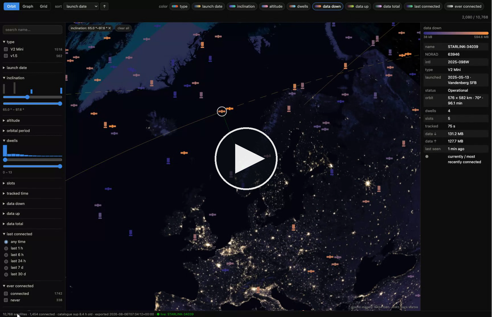

# starlink-satmatch

**Which Starlink satellite is my dish talking to — right now?**

The dish never tells you. But its obstruction map records which sky
directions the phased array actually used, and that's enough: reset the
map at a scheduling-slot boundary, watch which pixels light up second by
second, convert them to sky coordinates, and match the resulting track
against orbital propagation of the full ~10,000-satellite catalogue.

```
▶ 2026-08-05 08:58:28 UTC — STARLINK-6069 (NORAD 56804) ε=0.6° · el 54° az 254° · 706 km
■ 2026-08-05 08:59:12 UTC · ↓ 51.2 MB (9.1 Mbit/s) ↑ 12.6 MB (2.2 Mbit/s) · tracked 45 s · confirmed in 3/3 slot(s) · mean ε 0.5°
  ∑ all-time with this satellite: 1 dwell · 3 slots · 45 s · ↓ 51.2 MB ↑ 12.6 MB

▶ 2026-08-05 08:59:12 UTC — STARLINK-35177 (NORAD 65673) ε=0.5° · el 55° az 236° · 570 km
■ 2026-08-05 08:59:25 UTC · ↓ 28.0 MB (16.4 Mbit/s) ↑ 4.5 MB (2.6 Mbit/s) · tracked 14 s · confirmed in 1/1 slot(s) · mean ε 0.5°
  ∑ all-time with this satellite: 1 dwell · 1 slot · 14 s · ↓ 28.0 MB ↑ 4.5 MB
```

Identification runs at **0.3–1.3° mean angular error** with the runner-up
candidate typically 6–8° away — in practice, unambiguous. You watch the
constellation hand you between satellites every 15 seconds, see mid-slot
beam switches when your link degrades, and learn how many megabytes each
individual spacecraft carried for you.

And everything the tool learns feeds a visualization:

[](docs/murmuration-demo.mp4)

*(Click for the 2-minute demo: filtering and bucketing the constellation,
per-satellite gradient coloring, live traffic accumulating on the serving
satellite, and the orbital view with the dish's tracking line.)*

## Why this exists (and what's new here)

Estimating the serving satellite from the obstruction map was pioneered by
the University of Victoria group ([SatInView], [LEOViz], LEO-NET'24) and
refined for mobility in [arXiv:2601.13790]. satmatch builds on their method
and adds two things:

1. **A corrected map projection.** The published pixel→direction conversion
   treats `FRAME_UT` maps as a tilt-shifted zenith projection with zero
   image roll. That's only valid near the boresight axis on a roll-free
   mount. The map is actually an azimuthal-equidistant projection about the
   **boresight axis in dish body coordinates**, with the image roll
   recoverable from the status quaternion (image-down = body −y). On a
   kickstand Starlink Mini sitting with 23° of roll, this took residuals
   from 6–10° (off-axis tracks unmatchable) to **0.79° mean**. Derivation
   and validation: [docs/geometry.md](docs/geometry.md).

2. **GPS-less self-location.** Dish GPS is often policy-blocked ("allow
   access on local network" off). `locate` grid-searches for the observer
   position that makes the observed beam tracks consistent with the
   catalogue — a few minutes of observation pins the dish to ~10–20 km.
   The satellites tell you where you are. (The default search area covers
   Europe; elsewhere pass `--seed LAT,LON` or `--box LAT0,LAT1,LON0,LON1`.)

## The visualization

`visualization/` holds a faceted visualization of the whole catalogue plus
your personal history, in the spirit of Microsoft Live Labs Pivot (2009):
every satellite is an icon, and filtering, sorting, bucketing or re-coloring
makes the flock *fly* to its new arrangement instead of jump-cutting.

```sh
venv/bin/python visualization/serve.py    # exports data if stale, then serves
# open http://localhost:8642
```

- **Orbit view** (the default, framed on your dish's location): all 10k+
  satellites at their real SGP4 positions around a night-lights globe,
  with NASA Black Marble tiles sharpening as you zoom, a tether line from
  your dish to the serving satellite, and click-for-orbit-trails (past
  solid, future dashed). Switching views flies the camera and every
  satellite between orbit and the data layouts in one motion.
- **Graph view**: Pivot's signature histogram, literally stacked out of
  satellite icons — bucket by type, launch date, inclination, altitude,
  dwells, data volume, last-connected…
- **Live**: run `identify --dwells` alongside and the page tracks it —
  the serving satellite pulses green and jumps across handovers within
  seconds, the previous one trails in light green, and dwell stats,
  filter histograms and gradients update as dwells close.
- **Color**: toggle two-tone gradients per variable and blend several at
  once (mixed in OKLab); double-click a chip to edit colors and log/linear
  scaling.

Details in [visualization/README.md](visualization/README.md). Your usage
data (`satellites.json`, `current.json`, `sat_history.json`) stays local
and gitignored. Vendored: three.js and satellite.js (MIT); night imagery
courtesy NASA GIBS (attributed in-app).

## Getting started

```sh
git clone https://github.com/tijszwinkels/starlink-satmatch
cd starlink-satmatch
python3 -m venv venv && venv/bin/pip install -r requirements.txt
```

You need LAN access to the dish (`192.168.100.1:9200`; in bypass mode,
route the 192.168.100.0/24 subnet). Works with a plain consumer dish —
developed against a Starlink Mini.

**1. Tell it where you are.** Matching needs the observer position to about
10 km. Use your real GPS position if you can get one — from your phone, or
from the dish itself if "allow access on local network" is enabled in the
Starlink app. It's the most accurate option and it takes seconds:

```sh
venv/bin/python satmatch.py --location 59.91,10.75 --save-location fov
```

`--location` and `--save-location` are shared options, so they go *before* the
subcommand; `--save-location` writes the position to `location.json` once and
the later commands pick it up. (`fov` is read-only — it prints which satellites
are near the boresight right now, so it doubles as a check that the position
and the dish connection are both good.)

If dish GPS is policy-blocked and you have no other source, the dish can work
out where it is from the satellites it tracks. `locate` grid-searches for the
position that makes the observed beam tracks consistent with the catalogue and
writes `location.json` itself:

```sh
venv/bin/python satmatch.py locate     # a few minutes of tracks -> ~10-20 km
```

That's accurate enough to identify satellites, but a real GPS fix is better —
prefer it when you have one. (The default search area covers Europe; elsewhere
pass `--seed LAT,LON` or `--box LAT0,LAT1,LON0,LON1`.)

**2. Watch the handovers.**

```sh
venv/bin/python satmatch.py identify --dwells
```

**3. Bring up the visualization** in a second terminal, leaving `identify`
running so the page follows it live:

```sh
venv/bin/python visualization/serve.py
# open http://localhost:8642
```

`serve.py` is the only command you need for the page: it exports
`satellites.json` when it's missing or stale, serves the page on localhost,
and re-exports every 30 minutes. With `identify --dwells` running alongside,
the serving satellite pulses green through each handover and dwell stats,
histograms and colors update as you watch.

## Usage

```sh
venv/bin/python satmatch.py identify                 # observe until confident
venv/bin/python satmatch.py identify --dwells        # handover log (shown above)
venv/bin/python satmatch.py identify --dwells --satellite-info   # + per-satellite details
venv/bin/python satmatch.py identify --log-dwells    # + machine-readable dwells.jsonl
venv/bin/python satmatch.py locate                   # recover dish position from tracks
venv/bin/python satmatch.py fov                      # read-only: who's near the boresight
venv/bin/python satmatch.py info STARLINK-5539       # catalogue lookup by name/NORAD
venv/bin/python satmatch.py tle --refresh            # refresh the catalogue cache
```

Observer location resolution order: `--location lat,lon[,alt_m]` → dish GPS
(if enabled in the app) → saved `location.json`. Running `locate` once
writes `location.json` automatically (unless the fit is poor), so every
later command just works; `--save-location` persists a location given on
the command line the same way. Matching needs the position to ~10 km.

`--satellite-info` adds launch date/site, age, hardware generation
(heuristic — not published anywhere machine-readable), orbit from the
current TLE, and operational status per identified satellite:

```
STARLINK-5284 · NORAD 55297 · Intl 2023-010AE
    type:     v1.5 (Gen1)  [heuristic from launch date]
    launched: 2023-01-19 from Vandenberg SFB (Western Range) · age 3.5 years
    status:   Operational (SATCAT '+') · in SpaceX ephemerides feed
    orbit:    577 × 581 km · incl 70.0° · period 96.1 min  [TLE 0 d old]
```

## How it works

1. Starlink handovers happen on a globally synchronized 15 s grid
   (:12/:27/:42/:57 UTC). At each boundary, clear the obstruction map.
2. Sample the map at 2 Hz; pixels that turn on are where the beam pointed
   during that second.
3. Convert pixels to (el, az) with the boresight-frame projection
   ([docs/geometry.md](docs/geometry.md)).
4. Split the trail wherever it jumps — the dish re-targets mid-slot when
   the link degrades, and unsegmented trails produce confidently wrong IDs.
5. Match each segment against SGP4 propagation of the CelesTrak catalogue
   (SpaceX's supplemental ephemerides by default; direct-to-cell birds
   included — they carry the standard Ku/Ka payload too). The whole
   catalogue propagates in one vectorized call.
6. Score by mean angular separation plus a trajectory-direction term, and
   report ranked candidates with likelihoods. Ambiguous slots trigger
   further observation automatically.

Per-dwell data volumes come from the dish's 1 Hz throughput history,
integrated over slot-aligned dwell windows. The dish only counts space-link
traffic (verified: hammering its API at 12 Mbit/s moves the counters not at
all), so the tool's own polling — ~120 kB/s, LAN-only — never contaminates
the numbers. Everything the tool learns about your link stays on your
machine; the only internet access is downloading public catalogues.

## Files it writes

| file | what | when |
|---|---|---|
| `tle_cache/` | CelesTrak GP data + SATCAT | TLEs ≤12 h old, SATCAT ≤7 d |
| `location.json` | observer position (previous versions kept as `.bak`) | `locate` (automatic) / `--save-location` |
| `sat_history.json` | lifetime per-satellite tally (dwells, slots, time, bytes) | each dwell close |
| `dwells.jsonl` | append-only machine-readable dwell records | `--log-dwells` |

## Caveats

- **`identify` and `locate` reset the dish's obstruction map every 15 s.**
  The dish uses that map's history to plan around obstructions; it re-learns
  in ~12 h, but don't leave `--watch` running permanently on a link you
  depend on, and expect the app's obstruction display to look empty while
  the tool runs.
- Idle links get sparse beam grants; slots with fewer than 3 lit pixels
  yield no ID (reported honestly rather than guessed).
- `FRAME_EARTH` maps (some service plans) use the reference projection and
  are untested here — reports welcome.
- Hardware version in `--satellite-info` is inferred from launch date +
  orbital shell; SpaceX doesn't publish it.

## Accuracy

Validated live against a Starlink Mini at 62°N: per-slot ε 0.3–1.3°
(runner-up 6–8° away); synthetic end-to-end tests recover a known
satellite's rendered track from the full catalogue at <2°; the fast
propagation path agrees with Skyfield to <0.25°; `locate` recovered the
dish position to ~20 km (0.9° residual). Run the suite:

```sh
venv/bin/python test_satmatch.py
```

## Credits & prior art

- [starlink-grpc-tools][sgt] (sparky8512) — the dish gRPC layer this builds on.
- [SatInView] (Ahangarpour et al., LEO-NET'24) and [LEOViz] (Zhao) — the
  original obstruction-map serving-satellite identification method.
- [arXiv:2601.13790] — frame semantics, slot grid, dynamic beam switching.
- [CelesTrak] — GP element sets and the SATCAT.

[sgt]: https://github.com/sparky8512/starlink-grpc-tools
[SatInView]: https://github.com/aliahan/SatInView
[LEOViz]: https://github.com/clarkzjw/LEOViz
[arXiv:2601.13790]: https://arxiv.org/abs/2601.13790
[CelesTrak]: https://celestrak.org/

## License

MIT — see [LICENSE](LICENSE).
